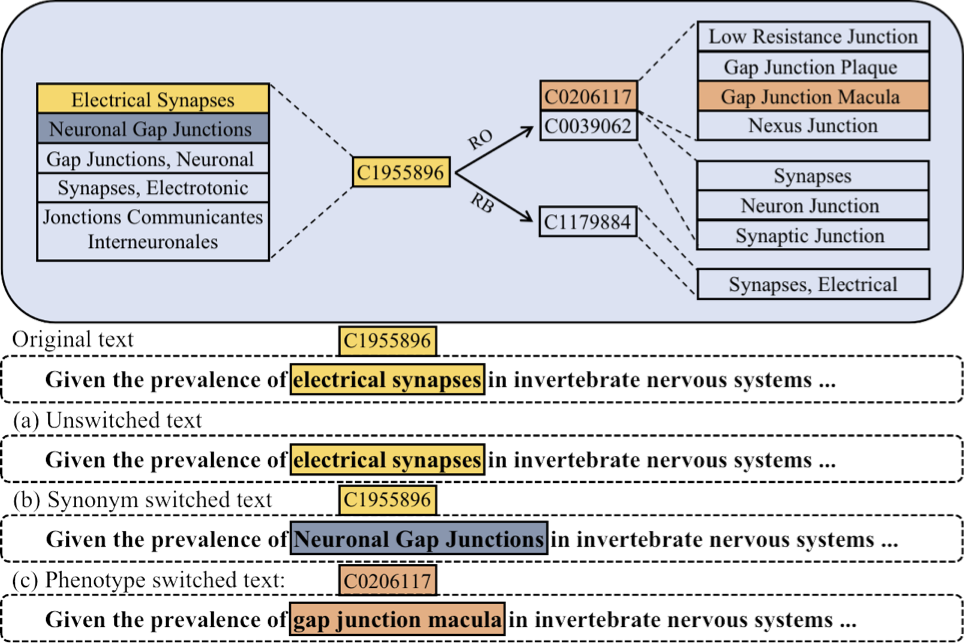

# BioPLM_InjectingKnowledge

This is the repository for [Injecting Knowledge into Biomedical Pre-trained Models via Polymorphism and Synonymous Substitution](https://arxiv.org/abs/2305.15010).

## Introduction
We propose a simple-yet-effective approach to inject relational knowledge into PLMs, which is inspired by three observations (namely, polymorphism, synonymous substitution, and association). In particular, we switch entities in the training corpus to related entities (either hypernyms/hyponyms/synonyms, or arbitrarily-related concepts).


We release the data and model weights in this repository.

<div align=center>

</div>

## Data
In our paper, we conducted an experiment to probe the knowledge of which subjects are replaced by synonyms or hyponyms. You can download our dataset from [here](data/additional_triples.zip). The data format is the same as [BioLAMA](https://github.com/dmis-lab/BioLAMA). 

## Pretrained Model
We release the pretrained model weights of our model on huggingface. You can download the model weights from [here](https://huggingface.co/StevenZHB/Bio-Inject-Bert).

## Citation
```bibtex
@misc{zhang2023injecting,
      title={Injecting Knowledge into Biomedical Pre-trained Models via Polymorphism and Synonymous Substitution}, 
      author={Hongbo Zhang and Xiang Wan and Benyou Wang},
      year={2023},
      eprint={2305.15010},
      archivePrefix={arXiv},
      primaryClass={cs.CL}
}
```